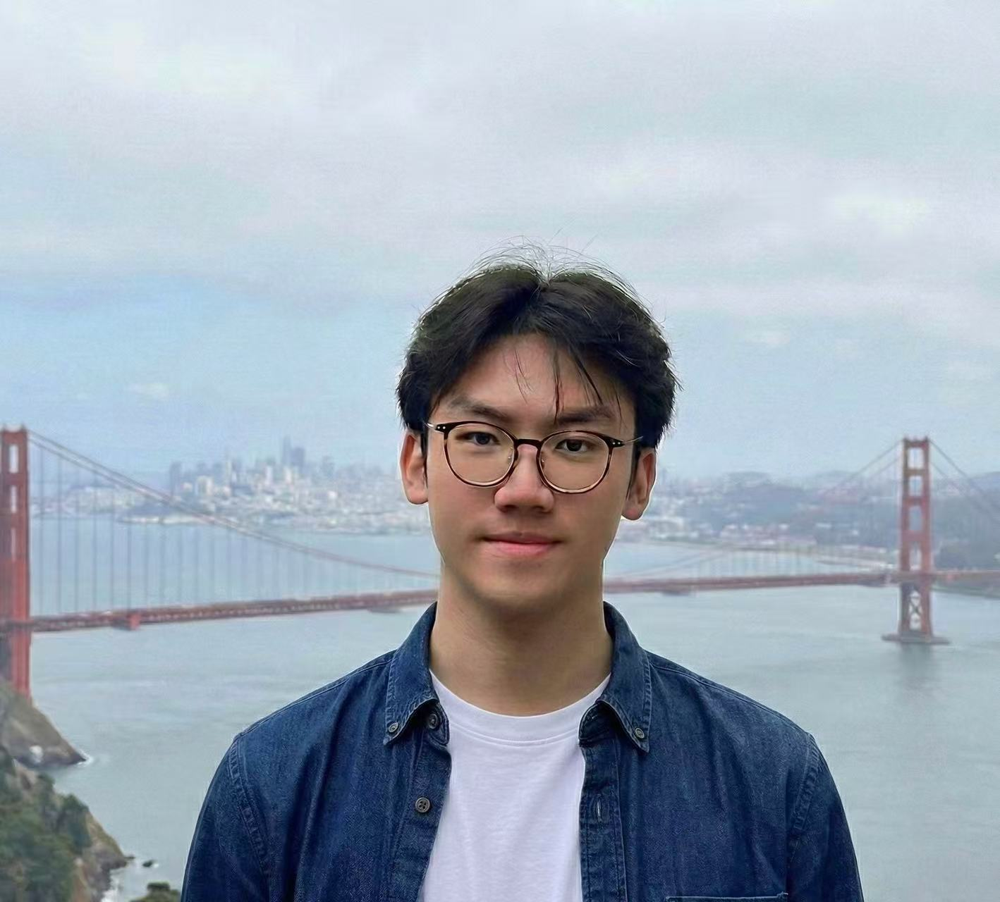

We are a team based in the [School of Computing, National University of Singapore](https://www.comp.nus.edu.sg).

## Project team

### Joshua Poon

[[github](https://github.com/eepyadventure)]
### Yucheng Wang

[[homepage](https://echoandland.github.io/)]
[[github](https://github.com/Echoandland)]
[[portfolio](team/Yucheng.md)]

* Role: Developer & Project designer
### Guo Xintong

* GitHub: [GuoxintongMark](https://github.com/GuoxintongMark)
* Role: Developer
* Responsibilities: Implementation and testing

### Eugene Ong

[[github](https://github.com/HoneyGlazedPorkChops)]

* Role: Team Lead
* Responsibilities: UI

### Johnny Doe

[[github](http://github.com/johndoe)] [[portfolio](team/johndoe.md)]

* Role: Developer
* Responsibilities: Data

### Jean Doe

[[github](http://github.com/johndoe)]
[[portfolio](team/johndoe.md)]

* Role: Developer
* Responsibilities: Dev Ops + Threading

### James Doe

[[github](http://github.com/johndoe)]
[[portfolio](team/johndoe.md)]

* Role: Developer
* Responsibilities: UI
