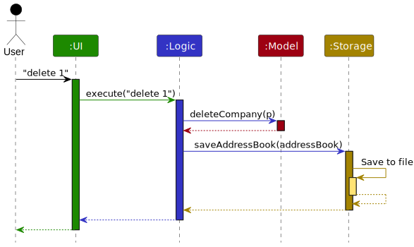
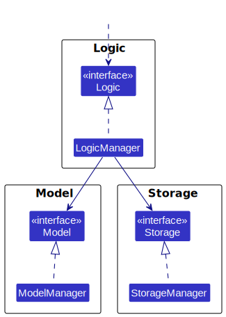
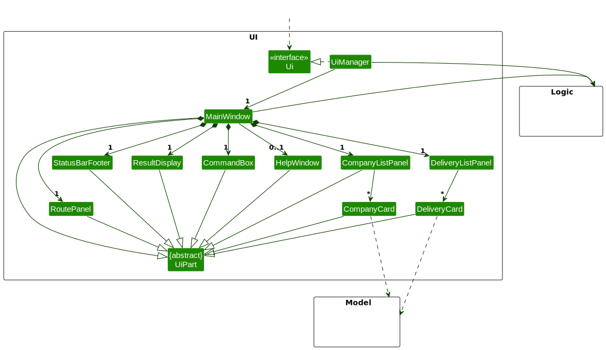
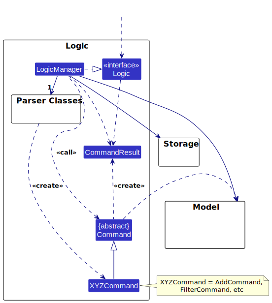
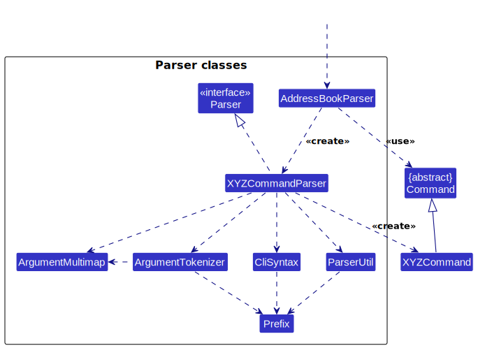
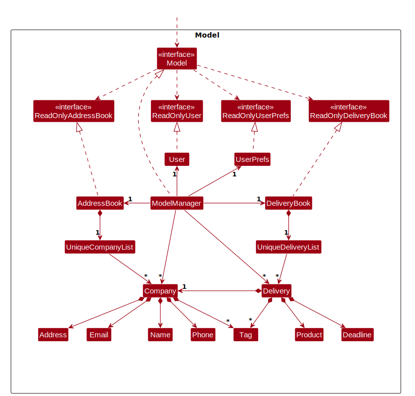
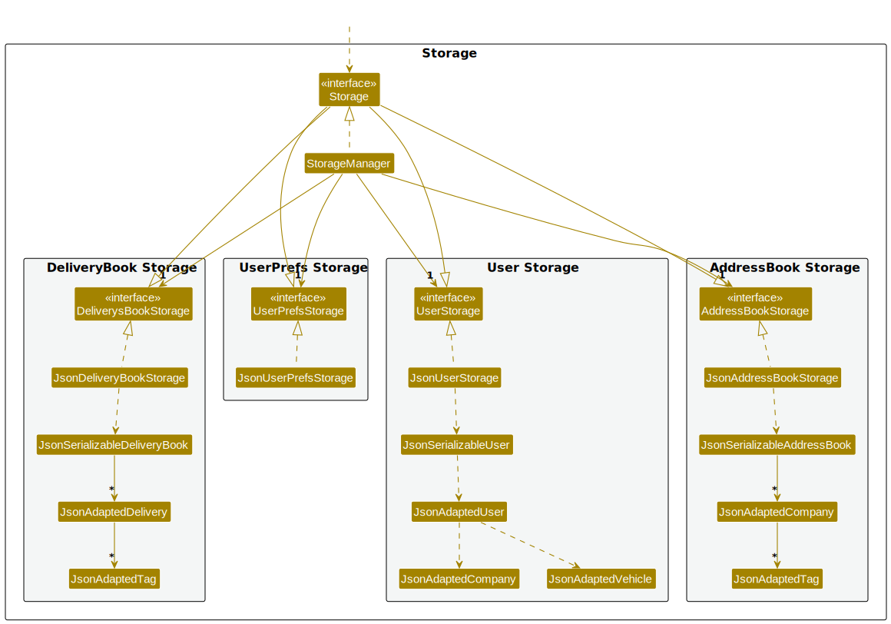
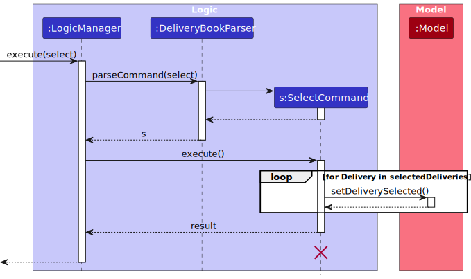
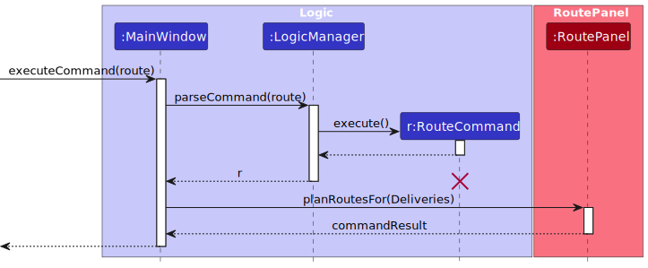
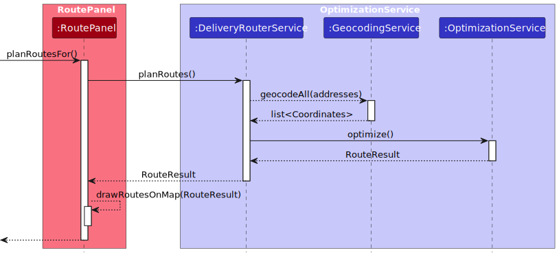

* Table of Contents
{:toc}

--------------------------------------------------------------------------------------------------------------------

## **Acknowledgements**

### External Services
- [OpenRouteService](https://openrouteservice.org/) — Route planning API
- [Leaflet.js](https://leafletjs.com/) — Interactive map rendering

### Security & Build Tools
- [ProGuard](https://www.guardsquare.com/proguard) 7.7.0
- [Aidsfuscator](https://github.com/LvStrnggg/aidsfuscator) 0.7.0
- [Gradle](https://gradle.org/)
- [Shadow Plugin](https://github.com/johnrengelman/shadow) 7.1.2
- [JaCoCo](https://www.jacoco.org/)
- [Checkstyle](https://checkstyle.org/) 11.0.0

### Libraries
- [JavaFX](https://openjfx.io/) 17.0.7
- [Jackson Databind](https://github.com/FasterXML/jackson-databind) 2.7.0
- [Jackson Datatype JSR310](https://github.com/FasterXML/jackson-modules-java8) 2.7.4
- [org.json](https://github.com/stleary/JSON-java) 20231013
- [JUnit Jupiter](https://junit.org/junit5/) 5.4.0

### AI Tools
- [Claude Sonnet 4.6](https://www.anthropic.com/) — Used as a coding and documentation aid; all suggestions were reviewed and adapted by the team before merging

--------------------------------------------------------------------------------------------------------------------

## **Setting up, getting started**

Refer to the guide [_Setting up and getting started_](SettingUp.md).

--------------------------------------------------------------------------------------------------------------------

## **Design**

:bulb: **Tip:** The `.puml` files used to create diagrams are in this document `docs/diagrams` folder. Refer to the [_PlantUML Tutorial_ at se-edu/guides](https://se-education.org/guides/tutorials/plantUml.html) to learn how to create and edit diagrams.

### Architecture

The ***Architecture Diagram*** given above explains the high-level design of the App.

Given below is a quick overview of main components and how they interact with each other.

**Main components of the architecture**

**`Main`** (consisting of classes [`Main`](https://github.com/se-edu/addressbook-level3/tree/master/src/main/java/seedu/address/Main.java) and [`MainApp`](https://github.com/se-edu/addressbook-level3/tree/master/src/main/java/seedu/address/MainApp.java)) is in charge of the app launch and shut down.
* At app launch, it initializes the other components in the correct sequence, and connects them up with each other.
* At shut down, it shuts down the other components and invokes cleanup methods where necessary.

The bulk of the app's work is done by the following four components:

* [**`UI`**](#ui-component): The UI of the App.
* [**`Logic`**](#logic-component): The command executor.
* [**`Model`**](#model-component): Holds the data of the App in memory.
* [**`Storage`**](#storage-component): Reads data from, and writes data to, the hard disk.

[**`Commons`**](#common-classes) represents a collection of classes used by multiple other components.

**How the architecture components interact with each other**

The *Sequence Diagram* below shows how the components interact with each other for the scenario where the user issues the command `delete 1`.

Each of the four main components (also shown in the diagram above),

* defines its *API* in an `interface` with the same name as the Component.
* implements its functionality using a concrete `{Component Name}Manager` class (which follows the corresponding API `interface` mentioned in the previous point.

For example, the `Logic` component defines its API in the `Logic.java` interface and implements its functionality using the `LogicManager.java` class which follows the `Logic` interface. Other components interact with a given component through its interface rather than the concrete class (reason: to prevent outside component's being coupled to the implementation of a component), as illustrated in the (partial) class diagram below.

The sections below give more details of each component.

### UI component

The **API** of this component is specified in [`Ui.java`](https://github.com/se-edu/addressbook-level3/tree/master/src/main/java/seedu/address/ui/Ui.java)

The UI consists of a `MainWindow` that is made up of several parts, including the `CommandBox`, `ResultDisplay`, `StatusBarFooter`, `RoutePanel` and the panels used to display book-specific data.

Unlike the original AB3 design, MyCelia supports two distinct operating contexts: the **Company Book** and the **Delivery Book**. The UI updates according to the current active book, displaying either `CompanyListPanel` or `DeliveryListPanel`. This allows both workflows to coexist within a single application window.

The UI component uses the JavaFX UI framework. The layout of these UI parts is defined in corresponding `.fxml` files in the `src/main/resources/view` folder. For example, the layout of the `MainWindow` is specified in `MainWindow.fxml`.

The `UI` component:

* executes user commands using the `Logic` component.
* listens for changes to `Model` data so that the displayed company list or delivery list can be updated automatically.
* keeps a reference to the `Logic` component, because the UI depends on it to parse and execute commands.
* depends on classes in the `Model` component, as it displays `Company` and `Delivery` objects stored in the application state.
* reflects the current mode of the application, allowing users to switch between the Company Book and Delivery Book through commands or the navigation bar pill toggle buttons.

This design supports MyCelia’s keyboard-first interaction model while keeping the interface intuitive for users managing both company and delivery information.

### Logic component

**API** : [`Logic.java`](https://github.com/se-edu/addressbook-level3/tree/master/src/main/java/seedu/address/logic/Logic.java)

Here's a (partial) class diagram of the `Logic` component:

The sequence diagram below illustrates the interactions within the `Logic` component, taking `execute("delete 1")` API call as an example.

:information_source: **Note:** The lifeline for `DeleteCommandParser` should end at the destroy marker (X) but due to a limitation of PlantUML, the lifeline continues till the end of diagram.

The Logic component is responsible for parsing and executing user commands.

In MyCelia, command parsing depends on the **currently active book**. Since the application supports both the **Company Book** and the **Delivery Book**, the Logic component routes user input to different parsers depending on the current mode stored in the `Model`.

More specifically:

1. When the user enters a command, the `LogicManager` receives the full command text.
2. The `LogicManager` checks the current application mode from the `Model`.
3. If the application is in Company Book mode, the input is passed to the company-side parser.
4. If the application is in Delivery Book mode, the input is passed to the delivery-side parser.
5. The selected parser creates the corresponding `Command` object.
6. The command is executed by the `LogicManager`.
7. The result of command execution is returned as a `CommandResult` object.

This separation is necessary because several command words, such as `add`, `edit`, `delete`, `filter`, and `listr`, are shared by both books but operate on different types of data. For example, `add` in the Company Book creates a `Company`, while `add` in the Delivery Book creates a `Delivery`.

The Logic component therefore uses book-specific parsers to avoid overloading a single parser with too many context-dependent branches. This improves maintainability and makes it easier to extend each workflow independently.

How the `Logic` component works:

* `LogicManager` acts as the main coordinator for command execution.
* Parsing is delegated to a parser appropriate for the current mode.
* The parser returns a concrete subclass of `Command`.
* The command interacts with the `Model` during execution.
* After execution, the `CommandResult` is returned back to the UI.

This design allows MyCelia to support two related but distinct workflows in a single application while preserving a consistent command-first user experience.

Here are the other classes in `Logic` (omitted from the class diagram above) that are used for parsing a user command in Company Book mode:

How the parsing works:
* When called upon to parse a user command, the `AddressBookParser` class creates an `XYZCommandParser` (`XYZ` is a placeholder for the specific command name e.g., `AddCommandParser`) which uses the other classes shown above to parse the user command and create a `XYZCommand` object (e.g., `AddCommand`) which the `AddressBookParser` returns back as a `Command` object.
* All `XYZCommandParser` classes (e.g., `AddCommandParser`, `DeleteCommandParser`, ...) inherit from the `Parser` interface so that they can be treated similarly where possible e.g, during testing.

### Model component
**API** : [`Model.java`](https://github.com/se-edu/addressbook-level3/tree/master/src/main/java/seedu/address/model/Model.java)

The `Model` component stores the in-memory state of MyCelia.

Unlike the original AB3 model, MyCelia manages two related sets of domain data: the **Company Book** and the **Delivery Book**. As a result, the `Model` component stores both `Company` objects and `Delivery` objects, together with their corresponding filtered lists for display and command execution.

The `Model` component,

* stores all `Company` objects in the Company Book.
* stores all `Delivery` objects in the Delivery Book.
* stores the currently filtered company list as an unmodifiable `ObservableList<Company>`, so that the UI can automatically update when the displayed company data changes.
* stores the currently filtered delivery list as an unmodifiable `ObservableList<Delivery>`, so that the UI can automatically update when the displayed delivery data changes.
* stores a mode flag indicating whether the application is currently operating in Company Book mode or Delivery Book mode.
* stores a `UserPref` object that represents the user’s preferences. This is exposed to the outside as a `ReadOnlyUserPref` object.
* does not depend on the `UI`, `Logic`, or `Storage` components, since the model represents the domain state of the application independently of how it is displayed, parsed, or persisted.

This design allows MyCelia to support two related workflows in a single application while keeping the company and delivery data logically separated.

### Storage component

**API** : [`Storage.java`](https://github.com/se-edu/addressbook-level3/tree/master/src/main/java/seedu/address/storage/Storage.java)

The `Storage` component is responsible for persisting MyCelia’s data on disk and reading it back when the application starts.

Since MyCelia manages both company data and delivery data, the storage layer is responsible for saving and loading both parts of the application state, in addition to user preferences.

The `Storage` component,

* can save both company-related data and delivery-related data in JSON format, and read them back into the corresponding model objects.
* can save and load user and user preference data.
* acts as the bridge between the hard disk representation of the application state and the in-memory model representation.
* depends on classes in the `Model` component because its purpose is to serialize and deserialize domain objects owned by the model.

This design ensures that changes made to either the Company Book or the Delivery Book can be preserved across application restarts while keeping persistence concerns separate from the in-memory business logic.

### Common classes

Classes used by multiple components are in the `seedu.address.commons` package.

--------------------------------------------------------------------------------------------------------------------

## **Implementation**

This section describes some noteworthy details on how certain features are implemented.

### Delivery-Company dependency

#### Implementation

To facilitate deliveries to an assigned company, MyCelia allows the user to create deliveries with reference to an existing company.

Internally, `AddCommand` does not store only a raw company name. Instead, it stores a `CompanyNameContainsKeywordsPredicate` and uses it during execution to search the existing Company Book for a matching company.

This design allows for changes within a `Company` to be reflected on the deliveries, reducing the need for users to manually edit every delivery if there is a change to the company.

Example:

Step 1: User enters `add p/Laptop c/Dell d/2026-03-25 14:30 t/urgent`

Step 2: Command is parsed by `DeliveryBookParser` and `AddCommand#execute(Model)` is called

Step 3: `AddCommand#findMatchingCompany(Model, CompanyNameContainsKeywordsPredicate)` is called which filters the existing companies by names.

Step 3a: If existing company with matching name is found, the `Company` instance will be passed on as a return value.

Step 3b: If there are no existing company with a matching name, `null` value is returned.

Step 4: If there is an existing company, `Delivery` will be created using the instance of `Company` found, otherwise a `CommandException` is thrown

Step 5. The model checks for duplicates and adds the delivery to the Delivery Book.

Step 6. The UI refreshes and shows the newly added delivery.

The following diagram demonstrates how the `AddCommand` happens through the `Logic` component

### Switch book feature
#### Implementation

MyCelia supports two operating modes: the Company Book and the Delivery Book.
This feature is facilitated by a mode flag stored in the Model component through `Model#getCompanyPackage()` and `Model#setCompanyPackage(boolean)`. The flag determines which parser and book-specific command set should be active at a given time.

At the user level, the command used is `switch`. In the Company Book, `SwitchCommand` sets the mode flag to false, which switches the application to the Delivery Book. In the Delivery Book, `SwitchCommand` sets the mode flag to true, switching back to the Company Book. The User Guide also states that this same command toggles between the two books, and that the navigation bar pill buttons provide an equivalent interaction.

This design allows MyCelia to reuse a single command box and window while exposing two different workflows. Instead of launching separate applications or windows, the system keeps both books in memory and changes only the active context. This keeps interaction fast and matches the product’s keyboard-first design.

Example:

Step 1. The user is currently viewing the Company Book.

Step 2. The user enters `switch`.

Step 3. `switch` is parsed by `AddressBookParser` and `SwitchCommand#execute(Model)` is called.

Step 4. The command updates the model mode flag by calling `Model#setCompanyPackage(false)`.

The following diagram demonstrates how the switch command goes through the `Logic` component starting from CompanyBook:

Step 5. The logic manager switches to `deliveryBookParser` and UI updates to show the Delivery Book instead.

#### Design considerations

Alternative 1 (current choice): Store both books in the same model and toggle the active mode with a boolean flag.
- Pros: Simple control flow, easy to integrate with one shared UI shell, and low overhead when switching.
- Cons: Parsers and UI logic need to consistently respect the current mode.

Alternative 2: Split the app into two separate windows or two separate applications.
- Pros: Stronger separation between workflows.
- Cons: Poorer user experience and more duplicated logic for shared functionality such as help, exit, and storage handling.

### Delivery routing
#### Implementation

MyCelia allows users to query a Routing API to obtain an efficient travel plan for the chosen deliveries. This feature allows for users to view an optimized path they can take to finish their deliveries within their stipulated deadlines.

This is done using the `SelectCommand` which takes in the indexes of the chosen deliveries as argument. After selection, the `RouteCommand` is used to check the selected deliveries for their deadlines and addresses, ensuring both fields are valid before being sent as a request to the API.

This design boosts the functionality of MyCelia while simultaneously handling any exceptions that may arise from invalid delivery deadlines or location.

Example:

Step 1: The user inputs `select 1 2 4` to select deliveries 1, 2 and 4 for routing.

Step 2: `Logic` executes the `SelectCommand` which shows the selected deliveries on the UI, allowing the user to check their selection.

The following diagram illustrates how the select command goes through the `Logic` component:

Step 3: The user confirms their selection and inputs `route`.

The following diagram illustrates how the select command goes through the `Logic` component:

Step 4: `RouteCommand` calls that `planRoutesFor()::RoutePanel` which checks for overdue deadlines and geocodes the addresses into coordinates using `GeocodingService`. If all deliveries are valid, a request is built via `OptimizationService` and sent to the API.

Step 5: `OptimizationService` parses the response from the API and returns the `RouteResult`.

Step 6: `RoutePanel` displays the `RouteResult` on the UI

The following diagram illustrates the entire process when `planRoutes()` is called:

### Routing API Key Security

#### Overview

MyCelia uses the [OpenRouteService (ORS)](https://openrouteservice.org/) API for geocoding and route optimisation. API requests require an authentication key. To prevent the key from being exposed in source code or intercepted from JVM memory, MyCelia uses a layered key resolution strategy with a secure subprocess execution model.

#### Key resolution order

When a routing request is made, `OrsHttpClient` attempts to resolve the API key in the following order:

1. **`KeyDeriver` (release builds)** — The real `KeyDeriver.java` is encrypted with git-crypt and only available to maintainers.

2. **Local key file (development builds)** — If `KeyDeriver.java` is the stub (see below), `OrsHttpClient` falls back to reading the key from a plain text file at:
   - Windows: `%APPDATA%\MyCelia\ors.key`
   - macOS: `~/Library/Application Support/MyCelia/ors.key`
   - Linux: `~/.local/share/MyCelia/ors.key`

#### Development setup (for contributors)

The real `KeyDeriver.java` is git-crypt encrypted and **not available in the public repository**. The repository ships a stub at `src/main/java/seedu/address/routing/security/KeyDeriverStub.java` instead. The Gradle build automatically copies this stub to `KeyDeriver.java` if the real file is absent, so the project compiles out of the box without any manual setup.

For routing to work during development, contributors need a personal ORS API key:

1. Register for a free key at [https://openrouteservice.org/](https://openrouteservice.org/)
2. Create the file `ors.key` in your MyCelia app data directory (the path is printed in the error message if routing is attempted without one)
3. Paste your API key as the only content of the file, with no extra whitespace

The Bootstrapper creates an `ors.key` placeholder file with instructions on first launch.

#### Release builds (for maintainers)

Release builds use the real `KeyDeriver.java`, which is stored encrypted in a separate private repository. To obtain access for a release build, contact the project maintainers. The release pipeline (`./gradlew packageRelease`) expects the decrypted `KeyDeriver.java` to be present at build time.

:warning: **Never commit a real ORS API key in plaintext** to any repository, public or private. Use only the `ors.key` file approach for development, and the encrypted `KeyDeriver.java` for releases.

--------------------------------------------------------------------------------------------------------------------

## **Documentation, logging, testing, configuration, dev-ops**

* [Documentation guide](Documentation.md)
* [Testing guide](Testing.md)
* [Logging guide](Logging.md)
* [Configuration guide](Configuration.md)
* [DevOps guide](DevOps.md)

--------------------------------------------------------------------------------------------------------------------

## **Appendix: Requirements**

### Product scope

**Target user profile**:

* Has a need to manage large number of deliveries from addresses to addresses
* prefer desktop apps over other types
* can type fast
* prefers typing to mouse interactions
* is reasonably comfortable using CLI apps

**Value proposition**: manage delivery details faster than a typical mouse/GUI driven app

### User stories

Priorities: High (must have) - `* * *`, Medium (nice to have) - `* *`, Low (unlikely to have) - `*`

| Priority | As a…           | I want to…                                          | So that I can…                          |
| -------- |-----------------|-----------------------------------------------------|-----------------------------------------|
| `* * *`  | user            | add addresses                                       | store new delivery locations            |
| `* * *`  | user            | remove addresses                                    | keep the address book clean             |
| `* * *`  | user            | edit addresses                                      | correct outdated location details       |
| `* * *`  | user            | create a delivery list                              | keep track of deliveries                |
| `* * *`  | user            | view delivery lists and addresses                   | know what to do next                    |
| `* * *`  | user            | mark a delivery as complete                         | track what is left                      |
| `* * *`  | user            | mark a delivery as incomplete                       | undo mistakes                           |
| `* * *`  | user            | add a client contact with key fields                | retrieve client details quickly         |
| `* * *`  | user            | create a delivery record linked to a client contact | track work by customer                  |
| `* * *`  | forgetful user  | track all deliveries for the day                    | complete them on time                   |
| `* *`    | Efficient user      | Plan the route beforehand                           | reach all locations quickly and easily  |
| `* *`    | user            | tag contacts (e.g., VIP/fragile/COD/restricted)     | filter for special handling             |
| `* *`    | user            | add cut-off timings to deliveries                   | know which deliveries must be done first |
| `* *`    | user            | sort deliveries by tags/time                        | prioritize efficiently                  |
| `*`      | first-time user | view a guided tour                                  | learn the app quickly                   |
| `*`      | Driving user    | View map through the app                            | to navigate quickly          |

### Use cases

#### UC01 Create a delivery record linked to a client contact

**Actor:** User
**Preconditions:**
- The user has launched Mycelia.
- A client contact already exists in the system.

**Main success scenario:**
1. User searches for a client contact using a keyword (e.g., client name).
2. System displays matching client contacts.
3. User selects the intended client contact.
4. User requests to create a delivery record and provides required details (e.g., delivery address, date/time, tags, cut-off time).
5. System validates the input.
6. System creates the delivery record linked to the selected client contact.
7. System shows a confirmation message.

**Extensions:**
- **2a. No matches found:** System shows “No matching contacts found” and ends the use case.
- **5a. Invalid/missing fields:** System shows validation errors and prompts user to correct the inputs.
- **6a. Duplicate record detected:** System warns the user and asks whether to proceed or cancel.

---

#### UC02 Mark a delivery as complete

**Actor:** User (dispatcher / delivery coordinator)
**Preconditions:**
- A delivery list for the day exists.
- At least one delivery record is currently not completed.

**Main success scenario:**
1. User requests to view today’s delivery list.
2. System displays the delivery list with current statuses.
3. User selects the target delivery record.
4. User marks the selected delivery record as **complete**.
5. System updates the delivery status.
6. System refreshes the delivery list and shows confirmation.

**Extensions:**
- **3a. Delivery not found:** System informs the user and ends the use case.
- **4a. Delivery already completed:** System warns the user and leaves the status unchanged.
- **4b. Wrong delivery chosen:** User marks the delivery as incomplete (undo) and repeats steps 3–6.

---

#### UC03 Tag a client contact for special handling

**Actor:** User
**Preconditions:**
- The client contact exists.

**Main success scenario:**
1. User searches for a client contact.
2. System displays matching contacts.
3. User selects the target contact.
4. User adds one or more tags (e.g., VIP, fragile, COD, restricted).
5. System updates the contact record and shows confirmation.

**Extensions:**
- **2a. No matches found:** System shows “No matching contacts found” and ends the use case.
- **4a. Tag already exists:** System ignores the duplicate tag and confirms completion.

---

### Non-functional requirements (NFRs)

**Usability:**

1. The application shall use consistent command formats and prefixes across all features, accepting only English characters.
2. The system shall provide a hint line showing the expected command format as the user types.

**Reliability:**

1. The system shall not lose existing data when an invalid command is entered.
2. The system shall respond to invalid commands with clear visual feedback.
3. The system shall not allow a delivery to be added if its linked company does not exist in the Company Book.

**Portability:**

1. The system shall run on Windows, Mac and Linux as long as Java 17 or above is installed.

**Performance:**

1. The system shall respond to any valid command within 2 seconds when the total number of entries does not exceed 1,000 companies and 1,000 deliveries.
2. The system shall plan and display an optimised route within 30 seconds for up to 5 selected deliveries under a stable internet connection.

**Persistence:**

1. The system shall save all data automatically after every command with no manual save required.
2. The system shall store data locally in addressbook.json and deliverybook.json.

**Reliability:**
1. In the event of a crash or connectivity loss, the system shall not lose more than **1 minute** of user edits (autosave or frequent persistence)

**Availability:**
1. Core features shall not depend on a custom remote server (the app remains usable without any self-hosted backend)

**Security:**

1. The system shall not transmit any user data over a network, except for route planning API calls.
2. API credentials used for route planning shall not be exposed in the repository.

**Accessibility:**

1. The system shall allow users to complete all core tasks using commands without requiring mouse interaction.

---

### Glossary

- **Client contact:** A customer entry (company/person) with key fields such as name, phone, address, and notes.
- **Partner:** A collaborating entity (e.g., supplier or 3PL partner) whose details are stored for coordination.
- **Delivery record:** A single delivery task, optionally linked to a client contact, containing address, timing, and status.
- **Delivery list:** A collection of delivery records grouped for a day or route.
- **Cut-off time:** The latest time by which a delivery should be completed.
- **Tag:** A label applied to contacts/addresses/deliveries for filtering and prioritization.
- **Special-handling tags:** Tags such as VIP/fragile/COD/restricted indicating extra constraints.
- **COD (Cash on Delivery):** A delivery that requires payment collection upon delivery.
-  **API:** Application Programming Interface is a set of functions and procedures that allows communication between different software applications.

--------------------------------------------------------------------------------------------------------------------

## **Appendix: Instructions for manual testing**

Given below are instructions to test the app manually.

:information_source: **Note:** These instructions only provide a starting point for testers to work on;
testers are expected to do more *exploratory* testing.

### Launch and shutdown

1. Initial launch as per [Quick Start](#quick-start)
   - Expected: GUI launches with sample companies and deliveries loaded in both books.

2. Saving window preferences
   - Resize and reposition the window, then close it.
   - Re-launch the app.
   - Expected: The most recent window size and location are retained.

---

### Global Commands

#### Switching books

1. Prerequisites: App is running.

2. Test case: `switch` from the Company Book
   - Expected: View switches to the Delivery Book. The **Deliveries** tab is now active.

3. Test case: `switch` from the Delivery Book
   - Expected: View switches back to the Company Book. The **Companies** tab is now active.

4. Test case: Click the **Companies** or **Deliveries** pill button in the navigation bar
   - Expected: Same behaviour as the `switch` command.

#### Setting the origin address

1. Prerequisites: App is running.

2. Test case: `set a/10 Anson Road, Singapore 079903`
   - Expected: Origin address is saved successfully.

3. Test case: `set` or `set a/`
   - Expected: Command input turns red and displays the correct command format.

---

### Company Book

#### Adding a company

1. Prerequisites: There should be no company named `Acme Supplies` in the Company Book.

2. Test case: `add n/Acme Supplies p/62223333 e/hi@acme.com a/10 Anson Road t/supplier`
   - Expected: Acme Supplies is added and appears in the Company Book.

3. Test case: `add`, `add n/Acme Supplies`, or any other incomplete input
   - Expected: Command input turns red and displays the correct command format.

4. Test case: `add n/Acme Supplies p/62223333 e/hi@acme.com a/10 Anson Road`
   - Prerequisites: A company with the same name and email already exists.
   - Expected: `This company already exists in the Company Book.` error.

#### Editing a company

1. Prerequisites: Run `list` and verify at least one company exists. Note its index.

2. Test case: `edit 1 p/65559999`
   - Expected: Phone number of the first company updates to `65559999`.

3. Test case: `edit 1 t/wholesale t/urgent`
   - Expected: All existing tags are replaced with `wholesale` and `urgent`.

4. Test case: `edit 1 t/`
   - Expected: All tags are cleared from the company.

5. Test case: `edit 1`
   - Expected: Command input turns red and displays the correct command format.

6. Test case: `edit 999 p/65559999` or any index that is out of range
   - Expected: `The company index provided is invalid`

#### Deleting a company

1. Test case: `delete 1`
   - Expected: The first company is removed from the Company Book.

2. Test case: `delete`
   - Expected: Command input turns red and displays the correct command format.

3. Test case: `delete 999` or any index that is out of range
   - Expected: `The company index provided is invalid`

#### Filtering companies

1. Prerequisites: There should be a company named `Dell Singapore` with tag `electronics`.

2. Test case: `filter c/Dell`
   - Expected: Dell Singapore appears in the filtered list.

3. Test case: `filter t/electronics`
   - Expected: All companies tagged `electronics` are displayed.

4. Test case: `filter c/Dell t/electronics`
   - Expected: Only companies matching both conditions are displayed.

5. Test case: `filter`
   - Expected: Command input turns red and displays the correct command format.

6. Test case: `unfilter`
   - Expected: All companies are shown again.

#### Clearing all companies

1. Prerequisites: There should be multiple companies in the Company Book. Verify with `list`.

2. Test case: `clear`
   - Expected: All companies and deliveries are permanently removed from the Company Book and Delivery Book.

---

### Delivery Book

📝 **Note:**

Switch to the Delivery Book with `switch` before running these test cases.

#### Adding a delivery

1. Prerequisites: A company named `Acme Supplies` exists in the Company Book.

2. Test case: `add p/Industrial Printer c/Acme Supplies d/2026-03-25 14:30 t/urgent`
   - Expected: Delivery is added and appears in the Delivery Book sorted by deadline.

3. Test case: `add p/Industrial Printer c/Acme Supplies d/2026-03-25 14:30 t/urgent`
   - Prerequisites: This exact delivery already exists.
   - Expected: `This delivery already exist in Delivery Book`.

4. Test case: `add`, `add p/Laptop`, or any other incomplete input
   - Expected: Command input turns red and displays the correct command format.

5. Test case: `add p/Laptop c/NonExistentCo d/2026-03-25 14:30`
   - Prerequisites: There is no company named `NonExistentCo` in the Company Book.
   - Expected: `Company not found`.

6. Test case: `add p/Laptop c/Acme Supplies d/25-03-2026`
   - Expected: Command input turns red and displays the correct command format.

#### Editing a delivery

1. Prerequisites: Run `list` and verify at least one delivery exists. Note its index.

2. Test case: `edit 1 d/2026-04-01 09:00`
   - Expected: Deadline of the first delivery updates and list re-sorts accordingly.

3. Test case: `edit 1 t/fragile`
   - Expected: Tags on the first delivery are replaced with `fragile`.

4. Test case: `edit 1` or `edit 999 d/2026-04-01 09:00`
   - Expected: Command input turns red and displays the correct command format.

5. Test case: `edit 1 c/NonExistentCo`
   - Expected: `Company not found`.

#### Deleting a delivery

1. Prerequisites: Run `list` and verify at least two deliveries exist.

2. Test case: `delete 1`
   - Expected: The first delivery is removed from the Delivery Book.

3. Test case: `delete` or `delete 999`
   - Expected: Command input turns red and displays the correct command format.

4. Test case: `delete 1000` or any invalid index
   - Expected: `The delivery index provided is invalid`

#### Marking and unmarking a delivery

1. Prerequisites: Run `list` and verify at least one delivery exists that is not yet marked as delivered.

2. Test case: `mark 1`
   - Expected: The first delivery shows a `delivered` tag.

3. Test case: `mark 1` again
   - Expected: Nothing changes.

4. Test case: `unmark 1`
   - Expected: The `delivered` tag is removed from the first delivery.

5. Test case: `unmark 1` again
   - Expected: Nothing changes.

6. Test case: `mark` or `unmark`
   - Expected: Command input turns red and displays the correct command format.

7. Test case: `mark 1000` or `unmark 1000`
   - Expected: `The delivery index provided is invalid`

#### Selecting deliveries and planning a route

1. Prerequisites: Run `list` and verify at least two deliveries exist. Ensure an origin address has been set with `set a/ADDRESS`.

2. Test case: `select 1 2`
   - Expected: Deliveries at indices 1 and 2 are checked for route planning.

3. Test case: `route` after a valid `select` command instance
   - Expected: Routes tab opens and displays an optimised route for the selected deliveries.

4. Test case: `select none`
   - Expected: All selections are cleared.

5. Test case: `route` with no deliveries selected
   - Expected: `No deliveries selected. Use checkboxes or the select command first`.

6. Test case: `select 1000` or any other invalid index
   - Expected: `The delivery index provided is invalid`

#### Sorting deliveries

1. Prerequisites: There should be at least two deliveries linked to different companies.

2. Test case: `sort c/`
   - Expected: Deliveries are sorted based off the alphabetical ordering of the Company names.

3. Test case: `list`
   - Expected: All deliveries are shown again, re-sorted by deadline.

4. Test case: `sort`
   - Expected: Command input turns red and displays the correct command format.

#### Filtering deliveries

1. Prerequisites: There should be a delivery linked to `Dell Singapore` with tag `fragile`.

2. Test case: `filter c/Dell`
   - Expected: All deliveries linked to Dell Singapore are shown.

3. Test case: `filter t/fragile`
   - Expected: All deliveries tagged `fragile` are shown.

4. Test case: `filter c/Dell t/fragile`
   - Expected: Only deliveries matching both conditions are shown.

5. Test case: `filter`
   - Expected: Command input turns red and displays the correct command format.

6. Test case: `unfilter`
   - Expected: All deliveries are shown again.

#### Clearing all deliveries

1. Prerequisites: There should be multiple deliveries in the Delivery Book. Verify with `list`.

2. Test case: `clear`
   - Expected: All deliveries are permanently removed from the Delivery Book.

---

### Saving data

1. Prerequisites: App is running.

2. Test case: Run any command that modifies data (e.g. add a company), then close and relaunch the app.
   - Expected: The modified data persists after relaunch.

3. Test case: Delete `addressbook.json` and restart the app.
   - Expected: App initialises with sample company data.

4. Test case: Enter invalid JSON into `deliverybook.json` and restart the app.
   - Expected: A warning is logged to the terminal and the app starts with an empty Delivery Book.

## Appendix: Effort

### Difficulty & Challenges

1. While AB3 deals with `Address Book`, our app handles and integrates two distinct entities — companies and deliveries — which are directly linked to each other.

2. Integrating an external API required securing sensitive credentials using git-crypt, adding an additional layer of complexity to the development workflow.

3. Ensuring consistent and expected behaviour across the company-delivery link was non-trivial — changes to a company could affect its associated deliveries, requiring careful coordination across the codebase.

4. Hard to navigate initially due to the large inherited AB3 codebase and layered architecture.

5. Extensive testing was needed due to the increased system complexity from managing two linked entities simultaneously.

6. Maintaining consistency across the application — commands had to behave predictably for both companies and deliveries, including parsing, validation, and user feedback.

### Effort & Achievements

1. Higher implementation effort required due to the more complex scope of managing two linked entities rather than one.

2. Successfully secured API credentials using git-crypt, ensuring sensitive data is never exposed in the repository.

3. Deepened existing features and created new features that complement the company-delivery relationship.

4. Conquered integration challenges to keep the company and delivery books in sync while maintaining clean separation of concerns.

5. Carefully reviewed each other's pull requests before merging to ensure code quality.

---

## Appendix: Planned Enhancements

Team size: 4

1. **Clearer error message display** — Some error messages are longer as there are more restrictions to the command usage. UI will be better accommodating for various lengths of error messages.

2. **Better UI support for route** — UI displayed for route command is very simple. There are situations where it might cause some overlaps which make user unable to click the deliveries.

3. **Add more specific error messages are shown to let user know what went wrong** - Currently the text turns red and a valid example will be shown for most invalid commands. Only certain errors have been adapted to be shown for the user. It will be more suitable to indicate to user exactly which field is missing or invalid.

4. **Better support for different OS** - There are some known issues such as being unable to use route command for different OS systems like `linux`. Better support for different systems will be implemented in the future.

5.**Add memory and offline support to route system** - Currently, users cannot access routes and coordinates they have accessed on a previous use nor can they use any of the map and route features without an active internet connection. For ease of use, speed and lower api load, it is better to save previously computed coordinates and route, potentially using them for offline repeated routes that some companies may often use.
