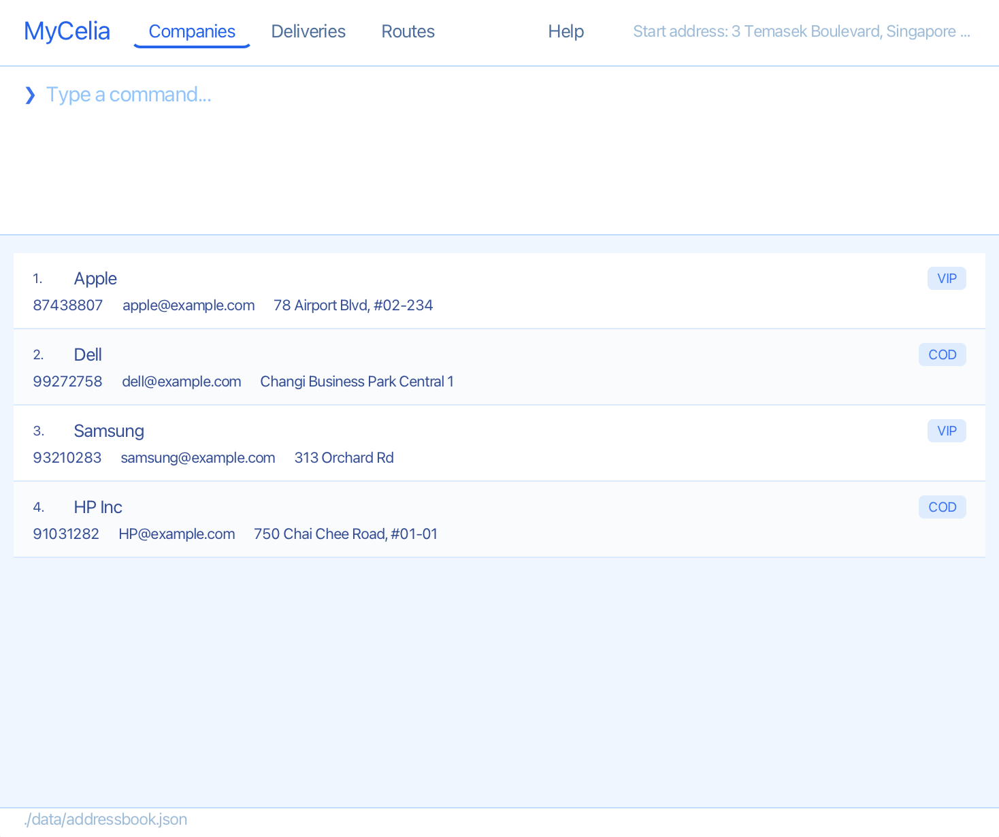
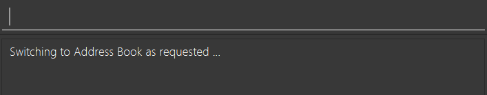
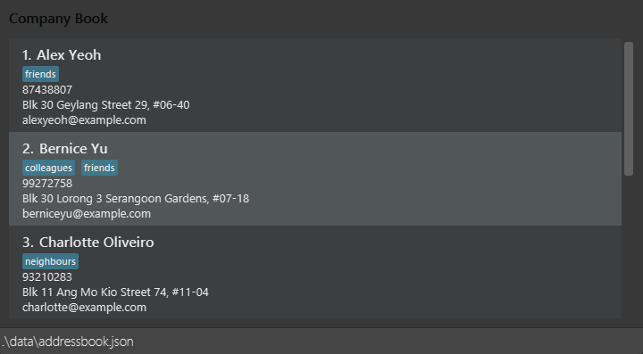
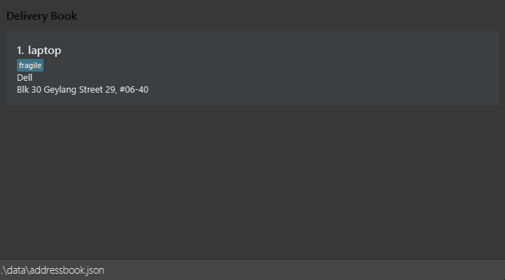
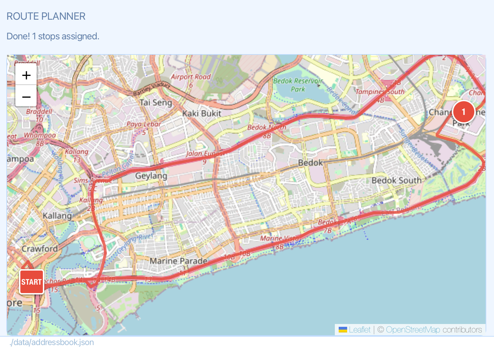

[](https://github.com/AY2526S2-CS2103T-W11-4/tp)

---
* TOC
{:toc}

--------------------------------------------------------------------------------------------------------------------

_MyCelia — named after mycelium, the underground network that keeps fungi connected. Because your business relationships deserve the same._

# MyCelia User Guide

MyCelia is a command-line-driven desktop application for B2B delivery coordinators. Manage your business contacts and track outgoing deliveries — all from a single keyboard-driven interface. No clicking around. Just type and go.



---

## Quick Start

That's it. MyCelia creates its data files on first launch and loads sample data so you can get your bearings immediately.

Follow these steps to get MyCelia running:

1. Ensure Java 17 or above is installed.
    * Full guide for installation [here](https://se-education.org/guides/tutorials/javaInstallation.html)

<div class="warning" markdown="1">
⚠️ **Important:**

 Mac users: Make sure to use this precise JDK version prescribed [here](https://se-education.org/guides/tutorials/javaInstallationMac.html).
</div>

2. Download the latest version of MyCelia [here](https://github.com/AY2526S2-CS2103T-W11-4/tp/releases).
    * Download the `.jar` file.

3. Open a terminal for your Operating System (OS) and launch MyCelia:

Open **Command Prompt** and run:

```bash
cd PATH_TO_FOLDER_WITH_JAR_FILE
java -jar vendorvault.jar
```

You're all set! MyCelia should come with Sample Data for you to get started on using the basic features.

---

## Features

### Before you begin


> MyCelia manages two separate books. Commands are **context-specific** — make sure you're in the right book before running a command.

| Book | What it contains | 
|------|-----------------|
| **Company Book** | Your directory of business partners, suppliers, and clients | 
| **Delivery Book** | Your log of outgoing deliveries linked to companies | 

Switch between them with a single command or via the UI tabs. Everything saves automatically.

---

### The Interface

MyCelia can be used entirely by keyboard, but several actions are also accessible through the UI directly.

### Navigation Bar


At the top of the window is a pill toggle bar with navigation buttons:

|Button|What it does|
|-|-|
|**Companies**|Switch to the Company Book — same as typing `switch` from the Delivery Book|
|**Deliveries**|Switch to the Delivery Book — same as typing `switch` from the Company Book|
|**Routes**|Switch to the Routes tab to view route plans|
|**Help**|Open the help window — same as typing `help`|

### Command Terminal



|Box|What it does|
|-|-|
|**Input**|Type commands here. A hint line below shows the expected format as you type, and a dropdown suggests matching commands.|
|**Response**|Displays the system's response to your last command|

Switching tabs clears the command input, since commands are tab-specific.

Every UI action has an equivalent command. Use whichever feels faster for your workflow.

### Help Window


The help window provides a link to this user guide.

### Company Book View



The Company Book view shows all your business contacts. Each entry displays the company name, phone number, email, address, and any tags assigned to it. Below is the location the data is saved.

### Delivery Book View



The Delivery Book view shows all logged deliveries. Deliveries marked as delivered will display a `delivered` tag and appear green. On the other hand, overdue deliveries will appear red.

You can check individual deliveries using their checkboxes to select them for route planning. A **Plan Today's Route** button at the top of the list becomes active when at least one delivery is selected — clicking it opens the Routes tab and plans the route.

### Routes View



The Routes view displays an interactive map with the optimised route for selected deliveries. Switch to it using the **Routes** pill button, or trigger it automatically via the `route` command or the **Plan Today's Route** button.

---

### Storage

* All data saves automatically after every command — no manual save needed
* Company records live in `addressbook.json`
* Delivery records live in `deliverybook.json`
* Both files are created in the same folder as the jar on first launch
* To back up, copy both JSON files somewhere safe
* To transfer to another machine, move the jar and both JSON files together

---

## Commands

---

### Global Commands

These commands work regardless of which book you are currently in.

#### Toggling between books: `switch`

Switches between the Company Book and the Delivery Book.

Format:
```
switch
```

<div class="note" markdown="1">
📝 **Note:**

You can also switch books using the **Companies** or **Deliveries** buttons in the navigation bar.
</div>

---

#### Setting the delivery origin address: `set`

Sets the starting point used for route planning.

Format:
```
set a/ADDRESS
```

Example:
- `set a/10 Anson Road, Singapore 079903`

<div class="note" markdown="1">
📝 **Note:**

This address is used as the origin when `route` plans an optimised delivery route. Set it once and it persists across sessions.

</div>

---

#### Viewing help: `help`

Opens the help window, which links to this user guide.

Format:
```
help
```

<div class="note" markdown="1">
📝 **Note:**

You can also open the help window by clicking the **Help** button in the navigation bar.
</div>

---

#### Exiting the app: `exit`

Saves all data and closes MyCelia.

Format:
```
exit
```

---

### Company Book

Manage your network of business contacts. These commands are active when you're in the Company Book.

| Command       | Format                                                                | Example                                                                   |
|---------------|-----------------------------------------------------------------------|---------------------------------------------------------------------------|
| Add           | `add n/NAME p/PHONE e/EMAIL a/ADDRESS \[t/TAG]...`                    | `add n/Acme Supplies p/62223333 e/hi@acme.com a/10 Anson Road t/supplier` |
| Edit          | `edit INDEX \[n/NAME] \[p/PHONE] \[e/EMAIL] \[a/ADDRESS] \[t/TAG]...` | `edit 2 p/65559999 e/new@acme.com`                                        |
| Delete        | `delete INDEX`                                                        | `delete 3`                                                                |
| Filter        | `filter [c/NAME] [a/ADDRESS] [p/PHONE] [e/EMAIL] [t/TAG]...`          | `filter c/Dell t/important`                                               |
| Clear filter  | `unfilter`                                                            | `unfilter`                                                                |
| List all      | `list`                                                                | `list`                                                                    |
| Clear all     | `clear`                                                               | `clear`                                                                   |

**Company prefixes:**

|Prefix|Field|Required|
|-|-|-|
|`n/`|Company name|Yes|
|`p/`|Phone number|Yes|
|`e/`|Email address|Yes|
|`a/`|Physical address|Yes|
|`t/`|Tag (repeatable)|No|

**Filter prefixes:**

|Prefix|Meaning|
|-|-|
|`c/`|Company name contains keyword|
|`a/`|Address contains keyword|
|`p/`|Phone number contains digits|
|`e/`|Email contains keyword|
|`t/`|Tag matches keyword|

<div class="note" markdown="1">
**📝Notes about the command format:**
- Words in `UPPER_CASE` are parameters to be supplied by the user.
- Items in square brackets such as `[t/TAG]` are optional.
- Parameters can be provided in any order unless otherwise stated.
</div>

---

#### Adding a company: `add`

Adds a new business contact to the Company Book.

Format:
```
add n/NAME p/PHONE e/EMAIL a/ADDRESS [t/TAG]...
```

Examples:
- `add n/Acme Supplies p/62223333 e/hi@acme.com a/10 Anson Road t/supplier`
- `add n/Dell Singapore p/65551234 e/contact@dell.com a/1 Harbour Front Ave t/electronics t/important`

<div class="note" markdown="1">
📝 **Note:**

A company can have any number of tags, or none at all.
</div>

<details>
<summary>What companies are considered duplicates?</summary>

<p>A company is considered a duplicate if it has the <strong>same name, phone, email and address</strong> as an existing entry. Company names are case-insensitive for matching purposes.</p>

</details>

For possible errors, refer to the [troubleshooting guide](#troubleshooting-add-company) below.

---

#### Listing all companies: `list`

Shows all companies in the Company Book.

Format:
```
list
```

---

#### Editing a company: `edit`

Edits an existing company entry by its index in the current list. Only the fields you specify will be updated.

Format:
```
edit INDEX [n/NAME] [p/PHONE] [e/EMAIL] [a/ADDRESS] [t/TAG]...
```

Examples:
- `edit 2 p/65559999 e/new@acme.com` — updates phone and email
- `edit 3 t/wholesale t/urgent` — replaces all existing tags

<div class="note" markdown="1">
📝 **Note:**

Specifying one or more `t/` fields replaces **all** existing tags — tags are not cumulative.
</div>

<details>
<summary>How do I remove all tags from a company?</summary>
<p>Specify <code>edit INDEX t/</code> without any tag value. This clears all existing tags from the entry.</p>
</details>

For possible errors, refer to the [troubleshooting guide](#troubleshooting-edit-company) below.

---

#### Filtering companies: `filter`

Displays companies matching the given keyword(s) across one or more fields.

Format:
```
filter [c/NAME] [a/ADDRESS] [p/PHONE] [e/EMAIL] [t/TAG]...
```

Examples:
- `filter c/Dell t/important`
- `filter a/Anson`

<div class="note" markdown="1">
**📝 Note:**

At least one prefix must be provided. Multiple prefixes narrow the results (AND logic).
</div>
---

#### Clearing a filter: `unfilter`

Resets the Company Book view to show all companies.

Format:
```
unfilter
```

---

#### Deleting a company: `delete`

Removes a company from the Company Book by its index.

Format:
```
delete INDEX
```

Example:
- `delete 3`

<div class="warning" markdown="1">
**⚠️ Important:**

Deleting a company automatically deletes its associated deliveries in the Delivery Book. 
</div>

For possible errors, refer to the [troubleshooting guide](#troubleshooting-delete-company) below.

---

#### Clearing all companies: `clear`

Permanently removes all companies from the Company Book.

Format:
```
clear
```

<div class="warning" markdown="1">
**⚠️ Important:**

This action is permanent and cannot be undone. Use with caution.
</div>

---

### Delivery Book

Track outgoing deliveries. Use `switch` or the Deliveries tab to get here from the Company Book.

<div class="warning" markdown="1"> 
⚠️ **Important:**

The company specified in `c/COMPANY` must already exist in the Company Book. If no matching company is found, the command will fail. The delivery is linked directly to the existing company record instead of storing a separate company name string.
</div>

| Command                | Format                                                       |Example|
|------------------------|--------------------------------------------------------------|-|
| Add                    | `add p/PRODUCT c/COMPANY d/DEADLINE [t/TAG]...`              |`add p/Industrial Printer c/Acme Supplies d/2026-03-25 14:30 t/urgent`|
| Delete                 | `delete INDEX`                                               |`delete 2`|
| Edit                   | `edit INDEX [p/PRODUCT] [c/COMPANY] [d/DEADLINE] [t/TAG]...` |`edit 1 d/2026-03-26 09:00 t/fragile`|
| Mark delivered         | `mark INDEX`                                                 |`mark 1`|
| Unmark                 | `unmark INDEX`                                               |`unmark 1`|
| Select for routing     | `select INDEX [INDEX]...`                                    |`select 1 3 5`|
| Clear selection        | `select none`                                                |`select none`|
| Plan route             | `route`                                                      |`route`|
| Filter                 | `filter [p/PRODUCT] [c/COMPANY] [d/DEADLINE] [t/TAG]...`     |`filter c/Dell p/Laptop t/fragile`|
| Reset filter           | `unfilter`                                                   |`unfilter`|
 List all               | `list`                                                       |`list`|
| Sort delivery by field | `sort [p/] [c/] [a/] [d/] [t/]`                              |`sort c/`|
| Clear all              | `clear`                                                      |`clear`|

**Delivery prefixes:**

|Prefix|Field|Required|
|-|-|-|
|`p/`|Product name|Yes|
|`c/`|Company name|Yes|
|`d/`|Deadline (`yyyy-MM-dd HH:mm`)|Yes for `add`, optional for `edit`|
|`t/`|Tag (repeatable)|No|

<div class="note" markdown="1">
📝 **Notes about the command format:**

- Company matching is case-insensitive.
- Deadlines must follow the format `yyyy-MM-dd HH:mm`.
- A duplicate delivery cannot be added.
</div>

---

#### Adding a delivery: `add`

Logs a new outgoing delivery.

Format:
```
add p/PRODUCT c/COMPANY d/DEADLINE [t/TAG]...
```

Examples:
- `add p/Industrial Printer c/Acme Supplies d/2026-03-25 14:30 t/urgent`
- `add p/Laptop c/Dell Singapore d/2026-04-01 09:00`

<div class="note" markdown="1">
📝 **Note:**

Deadlines must follow the format `yyyy-MM-dd HH:mm`. Company matching is case-insensitive.
</div>

<details>
<summary>What deliveries are considered duplicates?</summary>
<p>A delivery is a duplicate if it has the <strong>same product, company, and deadline</strong> as an existing delivery. Duplicate deliveries cannot be added.</p>
</details>

For possible errors, refer to the [troubleshooting guide](#troubleshooting-add-delivery) below.

---
#### Listing all deliveries: `list`

Shows all deliveries and re-sorts the list by deadline (earliest first).

Format:
```
list
```

<div class="note" markdown="1">
📝 **Note:**

Use `list` to reset the view after a `sort` command.
</div>
---

#### Editing a delivery: `edit`

Edits an existing delivery by its index. Only the fields you specify will be updated.

Format:
```
edit INDEX [p/PRODUCT] [c/COMPANY] [d/DEADLINE] [t/TAG]...
```

Examples:
- `edit 1 d/2026-03-26 09:00 t/fragile`
- `edit 2 c/Dell Singapore`

For possible errors, refer to the [troubleshooting guide](#troubleshooting-edit-delivery) below.

---

#### Marking a delivery as delivered: `mark`

Marks a delivery as completed. A `delivered` tag will appear on the entry.

Format:
```
mark INDEX
```

Example:
- `mark 1`

---

#### Unmarking a delivered delivery: `unmark`

Removes the delivered status from a delivery.

Format:
```
unmark INDEX
```

Example:
- `unmark 1`

---

#### Selecting deliveries for routing: `select`

Checks one or more deliveries to include in route planning.

Format:
```
select INDEX [INDEX]...
select none
```

Examples:
- `select 1 3 5` — selects deliveries at indices 1, 3, and 5
- `select none` — clears all selections

<div class="note" markdown="1">
📝 **Note:**

Individual deliveries can also be checked or unchecked via their checkboxes in the list. Repeating an index in the same command has no effect.
</div>

---

#### Planning a route: `route`

Opens the Routes tab and plans the optimised delivery route for all currently selected deliveries.

Format:
```
route
```

<div class="warning" markdown="1"> 
⚠️ **Important:**

Please ensure you have a stable internet connection before using this feature. The process might take a while.

At least one delivery must be selected before running `route`. Equivalent to clicking **Plan Today's Route** in the UI after selecting deliveries.
</div>

---

#### Sorting deliveries by company: `sort`

Filters to a specific company's deliveries and sorts them by deadline.

Format:
```
sort [p/] [c/] [d/] [t/]
```

Example:
- `sort c/`

<div class="note" markdown="1">
📝 **Note:**

The deliveries are sorted via lexicographical ordering of the fields selected. Doing `sort c/` will sort the deliveries via the alphabetical order of the company's name.
</div>

---

#### Filtering deliveries: `filter`

Displays deliveries matching the given keyword(s).

Format:
```
filter [p/PRODUCT] [c/COMPANY] [d/DEADLINE] [t/TAG]...
```

Example:
- `filter c/Dell p/Laptop t/fragile`

---

#### Resetting a filter: `unfilter`

Resets the Delivery Book view to show all deliveries.

Format:
```
unfilter
```

---
#### Deleting a delivery: `delete`

Removes a delivery by its index.

Format:
```
delete INDEX
```

Example:
- `delete 2`

For possible errors, refer to the [troubleshooting guide](#troubleshooting-delete-delivery) below.

---

#### Clearing all deliveries: `clear`

Permanently removes all deliveries from the Delivery Book.

Format:
```
clear
```

<div class="warning" markdown="1">
**⚠️ Important:**

> This action is permanent and cannot be undone.
</div>

---

## Troubleshooting

<div class="note" markdown="1">
📝 **Note:**

**Error** messages in red mean the command **did not succeed**.
</div>

---

### Global Commands

#### Troubleshooting `set`

| Scenario | Message shown | How to fix |
|----------|--------------|------------|
| No address prefix provided | `Invalid command format! ...` | Use the full format: `set a/ADDRESS`. |
| Address field is empty | `Address cannot be empty.` | Provide a non-empty address after `a/`. |

---

### Company Book

#### Troubleshooting `add` company

| Scenario | Message shown | How to fix |
|----------|--------------|------------|
| Missing one or more required prefixes (`n/`, `p/`, `e/`, `a/`) | `Invalid command format! ...` | Include all required fields: `add n/... p/... e/... a/...`. |
| Company with the same name and email already exists | `This company already exists in the Company Book.` | Check for an existing entry with `list` or `filter`. |
| Invalid email format | `Email address must be valid.` | Ensure the email follows the format `user@domain.com`. |
| Company name contains non-alphanumeric characters | `Company names may only contain alphanumeric characters and spaces.` | Remove any special characters from the name. |

---

#### Troubleshooting `edit` company

| Scenario | Message shown | How to fix |
|----------|--------------|------------|
| No fields specified to edit | `At least one field to edit must be provided.` | Include at least one of `n/`, `p/`, `e/`, `a/`, or `t/`. |
| Index is out of range | `The company index provided is invalid.` | Use `list` to check the valid index range. |
| Edited name or email matches an existing company | `This company already exists in the Company Book.` | Choose a different name or email. |

---

#### Troubleshooting `delete` company

| Scenario | Message shown | How to fix |
|----------|--------------|------------|
| No index provided | `Invalid command format! ...` | Provide the index: `delete INDEX`. |
| Index is out of range | `The company index provided is invalid.` | Use `list` to check the valid index range. |

---

#### Troubleshooting `filter` (Company Book)

| Scenario | Message shown | How to fix |
|----------|--------------|------------|
| No prefixes provided | `Invalid command format! ...` | Provide at least one filter prefix, e.g. `filter c/Dell`. |

---

#### Troubleshooting `sort` (Company Book)

| Scenario       | Message shown | How to fix                            |
|----------------|--------------|---------------------------------------|
| Invalid prefix | `Invalid command format! ...` | Use a valid prefix format: `sort n/`. |

---

### Delivery Book

#### Troubleshooting `add` delivery

| Scenario | Message shown | How to fix |
|----------|--------------|------------|
| Missing one or more required prefixes (`p/`, `c/`, `d/`) | `Invalid command format! ...` | Include all required fields: `add p/... c/... d/...`. |
| Company does not exist in the Company Book | `Company not found in the Company Book.` | Add the company first using `add` in the Company Book. |
| Deadline is in the wrong format | `Deadline must follow the format yyyy-MM-dd HH:mm.` | Use the correct format, e.g. `d/2026-03-25 14:30`. |
| Duplicate delivery already exists | `This delivery already exists in the Delivery Book.` | Check for an existing entry with `list` or `filter`. |

---

#### Troubleshooting `edit` delivery

| Scenario | Message shown | How to fix |
|----------|--------------|------------|
| No fields specified to edit | `At least one field to edit must be provided.` | Include at least one of `p/`, `c/`, `d/`, or `t/`. |
| Index is out of range | `The delivery index provided is invalid.` | Use `list` to check the valid index range. |
| Company specified does not exist | `Company not found in the Company Book.` | Ensure the company exists before linking it to a delivery. |
| Deadline format is invalid | `Deadline must follow the format yyyy-MM-dd HH:mm.` | Use the correct format, e.g. `d/2026-04-01 09:00`. |

---

#### Troubleshooting `delete` delivery

| Scenario | Message shown | How to fix |
|----------|--------------|------------|
| No index provided | `Invalid command format! ...` | Provide the index: `delete INDEX`. |
| Index is out of range | `The delivery index provided is invalid.` | Use `list` to check the valid index range. |

---

#### Troubleshooting `mark` / `unmark`

| Scenario | Message shown | How to fix |
|----------|--------------|------------|
| No index provided | `Invalid command format! ...` | Provide the index: `mark INDEX` or `unmark INDEX`. |
| Index is out of range | `The delivery index provided is invalid.` | Use `list` to check the valid index range. |
| Delivery is already marked as delivered | `This delivery is already marked as delivered.` | Use `unmark INDEX` if you need to reverse this. |
| Delivery is not marked as delivered | `This delivery has not been marked as delivered.` | Use `mark INDEX` first. |

---

#### Troubleshooting `select`

| Scenario | Message shown | How to fix |
|----------|--------------|------------|
| No index or `none` provided | `Invalid command format! ...` | Use `select INDEX [INDEX]...` or `select none`. |
| One or more indices are out of range | `The delivery index provided is invalid.` | Use `list` to check the valid index range. |

---

#### Troubleshooting `route`

| Scenario                       | Message shown | How to fix                                                                 |
|--------------------------------|--------------|----------------------------------------------------------------------------|
| Overdue delivery selected      | `Overdue Deliveries, please update the deadline...` | Do not select the overdue delivery or edit it to have a different deadline |

---

#### Troubleshooting `sort` (Delivery Book)

| Scenario                | Message shown | How to fix                            |
|-------------------------|--------------|---------------------------------------|
| Invalid prefix provided | `Invalid command format! ...` | Use a valid prefix format: `sort c/`. |

---

#### Troubleshooting `filter` (Delivery Book)

| Scenario | Message shown | How to fix |
|----------|--------------|------------|
| No prefixes provided | `Invalid command format! ...` | Provide at least one filter prefix, e.g. `filter c/Dell`. |
| Deadline filter is in the wrong format | `Deadline must follow the format yyyy-MM-dd HH:mm.` | Use the correct format, e.g. `d/2026-03-25 14:30`. |

## FAQ

<details>
<summary>How do I back up my data?</summary>
<ul>
<li>Locate the folder where MyCelia's <code>.jar</code> file is stored.</li>
<li>Copy both <code>addressbook.json</code> and <code>deliverybook.json</code> to a safe location of your choice.</li>
</ul>
<p>Both files contain all your company and delivery data respectively.</p>
</details>

<details>
<summary>How do I edit my data directly?</summary>
<ul>
<li>Locate the folder where MyCelia's <code>.jar</code> file is stored.</li>
<li>Open <code>addressbook.json</code> or <code>deliverybook.json</code> in a text editor.</li>
</ul>
<div class="warning" markdown="1">
⚠️ **Warning**

Follow the file format carefully. Files that do not conform to the required format will be considered invalid and MyCelia may not load them.
</div>
<p><code>addressbook.json</code> — stores company details:</p>
<pre><code class="language-json">{
  "persons": [ {
    "name": "NAME",
    "phone": "PHONE",
    "email": "EMAIL",
    "address": "ADDRESS",
    "tags": [ "TAGS" ]
  } ]
}</code></pre>
<p><code>deliverybook.json</code> — stores delivery details:</p>
<pre><code class="language-json">{
  "deliveries": [ {
    "product": "PRODUCT",
    "company": "COMPANY",
    "deadline": "yyyy-MM-dd HH:mm",
    "isDelivered": false,
    "tags": [ "TAGS" ]
  } ]
}</code></pre>
</details>

<details>
<summary>I edited the data file directly and MyCelia has some missing data. What should I do?</summary>
<p>Try the following steps:</p>
<ol>
<li><strong>Restore from backup</strong> — if you copied the JSON files before editing, replace the broken files with your backup copies.</li>
<li><strong>Fix it</strong> — if no backup exists, look through the JSON files and correct any fields which do not fit the format. Reboot MyCelia after fixing it.</li>
</ol>
</details>

<details>
<summary>How do I transfer my data to another computer?</summary>
<ol>
<li>Install MyCelia on the new computer.</li>
<li>On your old computer, locate the folder containing the <code>.jar</code> file.</li>
<li>Copy <code>addressbook.json</code> and <code>deliverybook.json</code> to an external drive or cloud storage.</li>
<li>On the new computer, replace the newly created JSON files with the ones from your old computer.</li>
<li>Relaunch MyCelia — your data should appear exactly as before.</li>
</ol>
</details>

<details>
<summary>Why did my route planning fail to assign some deliveries?</summary>
<p>Route planning requires at least one delivery to be selected. Use <code>select INDEX</code> or check the delivery's checkbox in the list, then run <code>route</code> again.</p>
<p>Also ensure your origin address has been set with <code>set a/ADDRESS</code>.</p>
</details>

<details>
<summary>Why is my route planning taking so long?</summary>
<p>Route planning requires an internet connection. If it is taking too long, please switch to a better connection.</p>
</details>

<details>
<summary>Why does adding a delivery fail even though the company exists?</summary>
<p>Company matching is case-insensitive but must be an exact name match — no partial matches. Make sure the name in <code>c/COMPANY</code> matches the name stored in the Company Book exactly.</p>
<p>Use <code>list</code> in the Company Book to verify the exact company name.</p>
</details>

---

## Known Issues

___

## Built With

* Java 17
* JavaFX
* Jackson (JSON serialisation)
* JUnit 5 (testing)
